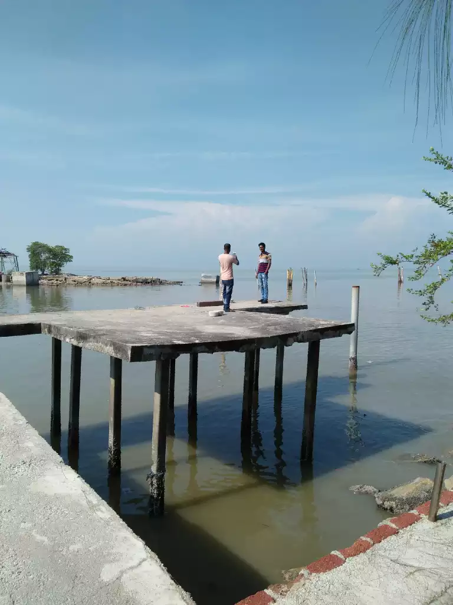
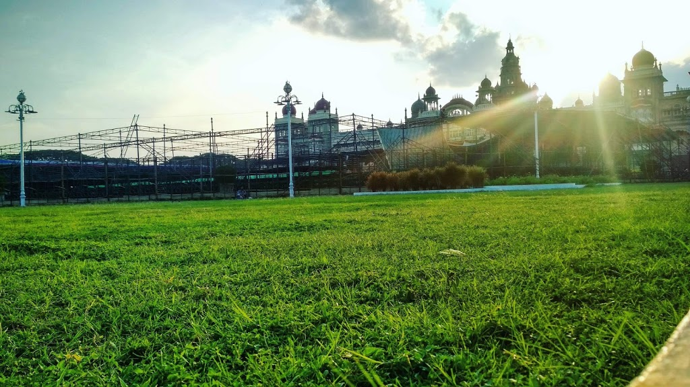
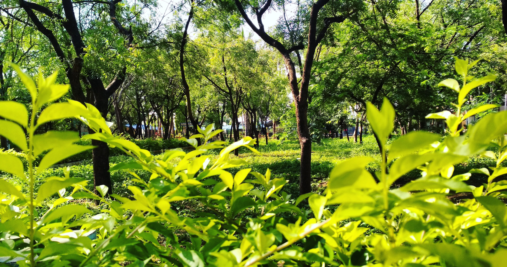

--- layout: default --- <meta charset="utf-8"> <meta content="width=device-width, initial-scale=1.0" name="viewport"> <title>My Portfolio</title> <meta content="EEE Final year Student. Intern at APSCL " name="descriptison"> <meta content="" name="keywords"> <link rel="icon" href="/assets/img/profile.png" type="image/jpg">  <link href="https://fonts.googleapis.com/css?family=Open+Sans:300,300i,400,400i,600,600i,700,700i|Raleway:300,300i,400,400i,500,500i,600,600i,700,700i|Poppins:300,300i,400,400i,500,500i,600,600i,700,700i" rel="stylesheet">  <link href="assets/vendor/bootstrap/css/bootstrap.min.css" rel="stylesheet"> <link href="assets/vendor/icofont/icofont.min.css" rel="stylesheet"> <link href="assets/vendor/boxicons/css/boxicons.min.css" rel="stylesheet"> <link href="assets/vendor/venobox/venobox.css" rel="stylesheet"> <link href="assets/vendor/owl.carousel/assets/owl.carousel.min.css" rel="stylesheet"> <link href="assets/vendor/aos/aos.css" rel="stylesheet">  <link href="assets/css/style.css" rel="stylesheet">    

<header id="header">

# [Md. Shahin Alom](index.html)

#### **Contributor**  

###### Leran machine Learning in Bangla

<nav class="nav-menu">

*   [Home](#hero)
*   [About](#about)
*   [Resume](#resume)
*   [Gallery](#portfolio)
*   [Contact](#contact)

</nav>

</header>

<section id="hero" class="d-flex flex-column justify-content-center align-items-center">

# Shahin Alom

Hi there I'm

</section>

<main id="main">

<section id="about" class="about">

## About

Hello !! My name is Shahin ALom. I'm a passionate Deep Learning and Machine Learning practitioner and I am always eager to learn new technologies. I like to experiment with new Machine Learning and Deep Learning libraries and use them to make cool projects. I write articles on Deep Learning for our facebook page(Machine Learining Talks & Tips) in my native language Bengali. I idolize great personalities like Geoffrey Hinton, Ian J. Goodfellow and I really fantacize to meet them one day 😊.

Currently I pursuing my undergraduate degree from Hajee Mohammad Danesh Science & Technology University, Dinajpur. I aspire to work on meaningful works that have some direct impact on people's lives.

  

### Deep Learning, IoT & Robitics Researcher

Electrical and Electronic Engineering Student || Machine Learning Engineer || Python programmer || Artificial Intelligence Enthusiast || Data Science Aspirant || Robotics & Embedded System Developer

*   **DoB:** 19 June 1998
*   **Github Username:** ashahin200
*   **Phone:** +8801704801703
*   **City:** Enayetpur, Sirajganj, Bangladesh

*   **Age:** 22
*   **Qualification:** B.Sc Engineering
*   **Email:** ashahin200@gmail.com
*   **Department:** EEE

</section>

<section id="facts" class="facts">

## Facts

In Numbers

11

**Publications IEEE Journal & conference**

14

**On Going Projects on Embedded System Design & Deep Learning**

10

**Achievement on Robotics Contest, Project Showcaing, Poster Presentation**

6

**Languages Known and practised**

</section>

<section id="skills" class="skills section-bg">

## Skills

Python

JAVA

JavaScript

C

C++

Arduino & Assembly

SQL

HTML

CSS

Photoshop

</section>

<section id="resume" class="resume">

## Resume

### Summary

#### Shahin Alom

_I'm currently pursuing final year undergraduate student in EEE department at HSTU. I am always curious to learn new technology and skills ._

*   Enayetpur, Sirajganj, Bangladesh
*   +8801704801703
*   ashahin200@gmail.com

### Area of Interest

###### Machine Learning

###### Deep Learning

###### Computer Vision

###### Robotics

###### Internet of Things

###### Data Science

### Education

#### B.Sc(Engineering) in EEE

##### 2016 - Running

_**Hajee Mohammad Danesh Science & Technology University(HSTU), Dinajpur**_

Expected CGPA 3.55 (out of 4).

#### Higher Secondary Certificate (H. S.C)

##### 2013 - 2015

_**Notre Dame College, Dhaka**_

with GPA 5(out of 5).

#### Secondary School Certificate (S.S.C)

##### 2011 - 2013

_**Sthal Pakrashi Institution School and College, Sirajganj**_

with GPA 5(out of 5).

</section>

<section id="resume" class="resume">

## Research Publication

##### 

**Some of my Research work :**

#### Cricket Sentiment Analysis from Bangla Text Using Recurrent Neural Network with Long Short Term Memory Model

_**Abstract**: Nowadays, people used to express their feelings, thoughts, suggestions and opinions on different social platform and video sharing media. Many discussions are made on Twitter, Facebook and many respective forums on sports especially cricket and football. The opinion may express criticism in different manner,._

*   [Read more...](https://doi.org/10.1109/ICBSLP47725.2019.201500)

#### Digit Recognition in Sign Language Based on Convolutional Neural Network and Support Vector Machine

_**Abstract**: Hearing and speech impaired individuals communicate using sign language among themselves and to the normal people. But it is challenging for non-sign language speaker to understand the sign language. Thus, sign language speaker or signer often finds difficulties in expressing their feelings._

*   [Read more...](https://doi.org/10.1109/STI47673.2019.9067999)

#### Bangla Compound Character Recognition by Combining Deep Convolutional Neural Network with Bidirectional Long Short-Term Memory

_**Abstract**: Recognition of Bangla handwritten compound characters has a significant role in Bangla language in order to develop a complete Bangla OCR. It is a challenging task owing to its_

*   [Read more...](https://doi.org/10.1109/EICT48899.2019.9068817)

#### Deep Convolutional Neural Network for Microscopic Bacteria Image Classification

_**Abstract**: Bacterial classification is crucial in medical science in order to diagnosis specific causative agent of numerous fatal diseases. Moreover, treatment of bacterial infection has also been possible through understanding of its nature and classification. Besides that,_

*   [Read more...](https://doi.org/10.1109/ICAEE48663.2019.8975588")

#### Deep Convolutional Neural Network Exploiting Transfer Learning for Country Recognition by Classifying Passport Cover

_**Abstract**: Nowadays, Citizen of one country is traveling to another country to settle their various needs through widespread modern transportation system. However, Passport_

*   [Read more...](https://doi.org/10.1109/ICAEE48663.2019.8975666)

#### Performance Analysis of Machine Learning Techniques for Microscopic Bacteria Image Classification

_**Abstract**: Microscopic bacterial image classification is of great significance in medical science in order to diagnosis numerous fatal diseases caused by bacteria._

*   [Read more...](https://doi.org/10.1109/ICCCNT45670.2019.8944597)

#### Rice Disease Identification and Classification by Integrating Support Vector Machine With Deep Convolutional Neural Network

_**Abstract**: Over the world, rice is one of the most extensively consuming staple foods. But due to various diseases of rice, farmers can't yield rice according to their expectation.._

*   [Read more...](https://doi.org/10.1109/ICASERT.2019.8934568)

#### Wireless Home Automation System Using IoT and PaaS

_**Abstract**: Home automation based on Internet of Things (IoT) is getting huge attention of mass people in recent years. Smart home eases and secures the management of the home appliances._

*   [Read more...](https://doi.org/10.1109/ICASERT.2019.8934676)

</section>

<section id="resume" class="resume">

## Projects

##### 

**Some of my Projects :**

#### Deploy-Image-Classificion-app-using-Flask

_This is a deep learning project. I used Convolutional Neural Networks to classify MNIST handwritten data. For more convenient propose of test data, used flask microweb framework to deploy it in a server and then you can access and test it remotely from any desktop browser. You can also test it from your desktop localhost.._

*   [Project Link](https://github.com/ashahin200/Deploy-Image-Classificion-app-using-Flask)

#### Covid19 prediction from X-ray image

_Covid_19 X_ray image prediction using Convolution Neural network. This is a demo project.._

*   [Project Link](https://github.com/ashahin200/Covid_19)

#### Real Time Face Mask Detection using Deep Learning and Computer Vision

_Real Time Face Recognition using Deep Learning and Opencv._

*   [Project Link](https://github.com/ashahin200/Image_augmentation")

#### Emotion Recognition with Keras

_Emotion Recognition with Keras._

*   [Project Link](https://github.com/ashahin200/Emotion-Recognition-with-Keras)

#### Principal_Component_Analysis

_Reduce the dimension of a dateset by extracting only high variance data structure._

*   [Project Link](https://github.com/ashahin200/Principal_Component_Analysis)

#### Robotics & Embedded Sysytem Design

*   _Wireless Home Automation System Using Arduino and Ethernet Shield._*   _Semi-autonomous quad-copter Drone_*   _Autonomous line and wall follower robot_*   _Automatic Alcohol Detecting Device with Engine Locking System_

*   [Project Link](https://www.youtube.com/channel/UCwCItw_xlM9aN_O6U8S-DtQ)

</section>

<section id="portfolio" class="portfolio section-bg">

## Portfolio

Some of My Clicks

*   All
*   Landscape
*   Portrait

</section>

<section id="contact" class="contact">

## Contact

#### Location:

Enayetpur, Sirajganj, Bangladesh

#### Email:

[

ashahin200@gmail.com

](mailto:ashahin200@gmail.com?Subject=Hello)

#### Call:

[

+8801704801703

](tel:+8801704801703)

<iframe src="https://www.google.com/maps/embed?pb=!1m18!1m12!1m3!1d116339.48008043526!2d88.76292839916742!3d24.325278618258654!2m3!1f0!2f0!3f0!3m2!1i1024!2i768!4f13.1!3m3!1m2!1s0x39fde0afec9cba7d%3A0x31958b82823e70b!2zRW5heWV0cHVyLCDgpqzgpr7gpoLgprLgpr7gpqbgp4fgprY!5e0!3m2!1sbn!2sfr!4v1598898639471!5m2!1sbn!2sfr" width="100%" height="400px" frameborder="0" style="border:0;" allowfullscreen="" aria-hidden="false" tabindex="0"></iframe>

</section>

© Copyright **Shahin**

Designed by [BootstrapMade](#)

</main>

